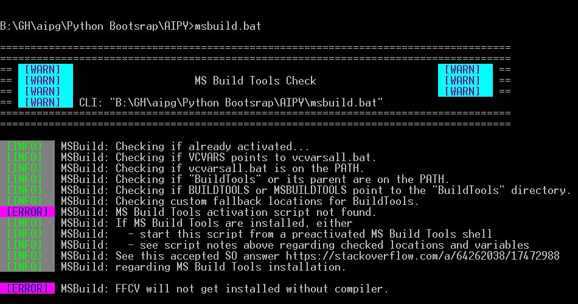
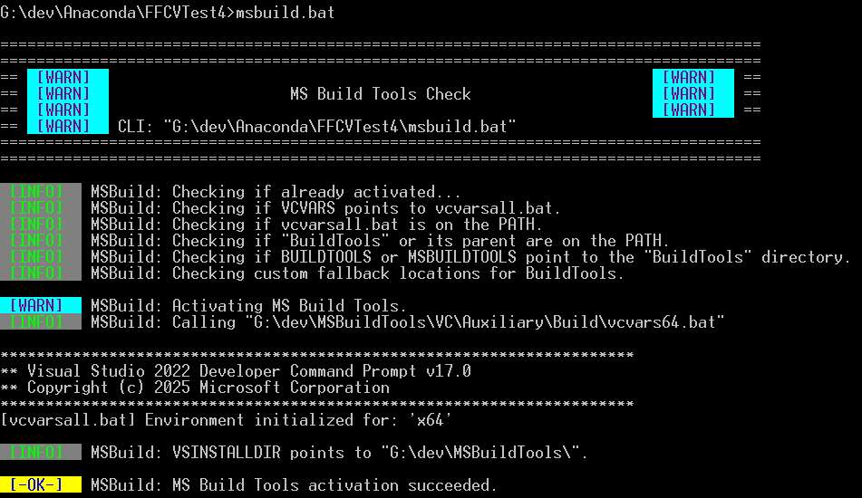
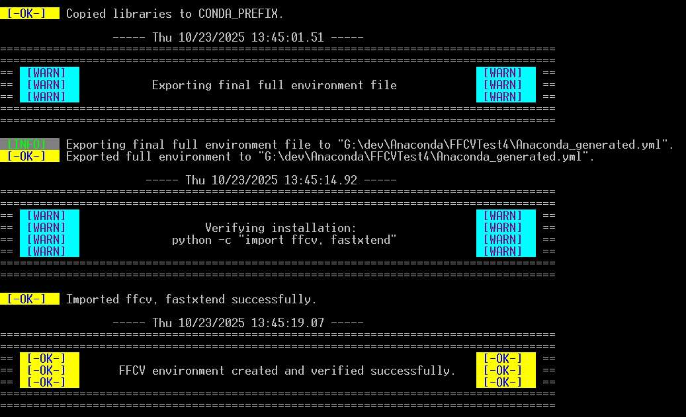

# **Building and Installing FFCV on Windows**

_Self-contained Windows scripts for bootstrapping reproducible, isolated Python environments with natively built FFCV and Fastxtend - using Micromamba and MSVC._

## Summary

This project provides a fully automated Windows build pipeline for the [FFCV](https://github.com/libffcv/ffcv) and [Fastxtend](https://github.com/warner-benjamin/fastxtend) libraries. It reconstructs missing installation logic for native dependencies and configures a clean, reproducible environment using Micromamba and MS Build Tools - all without requiring a preinstalled Python setup.

The provided scripts:  
- Bootstrap a self-contained, Conda-compatible environment (`Anaconda.bat`);
- Automatically fetch and prepare OpenCV, pthreads, and LibJPEG-Turbo;
- Intelligently detect and activate the MSVC toolchain (`msbuild.bat`); and
- Build and install **FFCV** and **Fastxtend** directly from PyPI without any developer's manual intervention.

The environment targets Windows 10+ with ANSI-color-capable terminals (set `NOCOLOR=1` for graceful fallback). Its modular design emphasizes transparency, reproducibility, and debuggability, making it both a practical solution and a learning tool for developers exploring Python’s native build systems on Windows.

## 💡 Motivation

While FFCV and Fastxtend are potentially powerful tools for high-throughput data loading and fastai integration, their Windows installation workflow has long been underdocumented and partially broken. The original build process lacks proper handling of native dependencies and fails to interface cleanly with the MSVC toolchain.

This project fills that gap - providing a transparent, script-driven build system that makes native Windows installations reproducible, educational, and reliable for both experimentation and production use.

## ⚡ Quick Start

### 🧭 Prerequisites

1. **Windows 10/11:** Modern `cmd.exe` with ANSI color support is recommended.
2. **MS Build Tools:** The C++ workload is required. You can install this toolchain with the [Visual Studio Build Tools](https://visualstudio.microsoft.com/visual-cpp-build-tools) (select "Desktop development with C++").
3. **System Tools:** `curl.exe` and `tar.exe` must be in your `PATH`. (These tools are included by default in modern Windows 10/11).
4. **Internet Access:** Required to download libraries and packages.

> 💡 **Tip:** Set `NOCOLOR=1` (e.g., `set NOCOLOR=1`) to disable ANSI colors if your console doesn't support them.

### 🚀 Installation

**1. Clone the Repository:**

```
git clone https://github.com/pchemguy/FFCVonWindows.git
cd AIFFCV
```

**2. Run the Bootstrapper:**

From a clean cmd.exe prompt (i.e., without any other Python or Conda environment already activated), run the main entry point:

```
> Anaconda.bat
```

This single script will:  
- Verify all prerequisites (including MSVC, GPU, `curl`, `tar`).
- Set up a local cache directory.
- Fetch and extract OpenCV, pthreads, and LibJPEG-Turbo.
- Download Micromamba.
- Create the full Conda environment from the included YAML files.
- Install `ffcv` and `fastxtend`, compiling them with the activated MSVC toolchain.
- Verify the installation.

### ⚙️ MSVC Detection

The `Anaconda.bat` script (via `msbuild.bat`) will automatically try to find your MS Build Tools installation. It checks standard install paths, environment variables (`%ProgramFiles%`, `BUILDTOOLS`, etc.), and `PATH`.

If the script fails at the "MS Build Tools Check" step (see screenshot below), it means it couldn't find your installation.

**To fix this problem:** You can "help" the script by setting the `BUILDTOOLS` environment variable to point to your installation directory _before_ running `Anaconda.bat`. This is the directory containing the `VC`, `Common7`, etc. folders.

```
:: Example:
set "BUILDTOOLS=C:\Program Files\Microsoft Visual Studio\2022\BuildTools"
> Anaconda.bat
```

### 🎨 Color Convention

Scripts use consistent, minimal color-coded labels (set `NOCOLOR=1` for plain text):

| **Label**   | **Meaning**                                                                        |
| ----------- | ---------------------------------------------------------------------------------- |
| **[WARN]**  | Major stage banner, beginning of a subtask, or warning (e.g. MS Build Tools check) |
| **[INFO]**  | Progress and diagnostic output                                                     |
| **[-OK-]**  | Successful task or step completion                                                 |
| **[ERROR]** | Critical failure causing termination                                               |

At the end of a successful installation, you should see an `[OK]` banner as shown below.

**MS Build Tools Check - Failed**



**MS Build Tools Check - Passed**



**Successful Completion**



## 🗂️ Project Structure

This repository is designed as a self-contained build system. Here are the key components and their roles:

| **File / Directory**         | **Role**                                                                                                                                                                                                                                  |
| ---------------------------- | ----------------------------------------------------------------------------------------------------------------------------------------------------------------------------------------------------------------------------------------- |
| **`Anaconda.bat`**           | **Main Entry Point.** Orchestrates the entire bootstrap, download, and installation process. This is the only script you need to run.                                                                                                     |
| `Anaconda.yml`               | The **main Conda environment** file. Defines all Python packages (PyTorch, fastai, etc.) for the project.                                                                                                                                 |
| `Anaconda_bootstrap.yml`     | A **minimal environment** file used _only_ by `Anaconda.bat` to set up a tiny base with Micromamba and `uv` before creating the full environment.                                                                                         |
| **`conda_far.bat`**          | **Environment Activator.** This script _activates_ the fully-configured environment, ensuring MSVC and all library paths are set correctly. It is used by `Anaconda.bat` and can be run manually to enter an interactive activated shell. |
| **`msbuild.bat`**            | **MSVC Detector.** A robust helper script that finds and activates the MS Build Tools environment. Called by other scripts.                                                                                                               |
| **`libs.bat`**               | **Library Manager.** A multi-purpose script for managing native dependencies. `Anaconda.bat` calls it to download, extract, and "install" (copy) DLLs. `conda_far.bat` calls it to activate library paths.                                |
| `pthreads/activate.bat`      | Sets the `INCLUDE`, `LIB`, `LINK`, and `PATH` variables for the pthreads library.                                                                                                                                                         |
| `opencv/activate.bat`        | Sets the `INCLUDE`, `LIB`, `LINK`, and `PATH` variables for the OpenCV library.                                                                                                                                                           |
| `libjpeg-turbo/activate.bat` | Sets the `INCLUDE`, `LIB`, `LINK`, and `PATH` variables for the Conda-provided LibJPEG-Turbo library.                                                                                                                                     |

## 🔬 Deep Dive

### The General Problem: Building Native Python Packages on Windows

When `pip install` builds a package from source, it invokes the MSVC toolchain (compiler and linker). This process fails if the toolchain cannot find the C/C++ header files (`.h`), import libraries (`.lib`), and linker targets for the package's native dependencies.

Unlike Linux, which uses standard paths like `/usr/include`, Windows paths are fragmented. To find necessary files, the MSVC toolchain relies on four key environment variables:

|**Variable**|**Purpose**|
|---|---|
|`INCLUDE`|**Compiler:** Directories containing header files (`*.h`).|
|`LIB`|**Linker:** Directories containing import libraries (`*.lib`).|
|`LINK`|**Linker:** Additional arguments, including the _specific names_ of the `*.lib` files to link (e.g., `pthreadVC2.lib`).|
|`PATH`|**Runtime:** Directories containing dynamic-link libraries (`*.dll`).|

If these variables are pre-set with the correct paths _before_ `pip install` is run, the build should succeed even if the package's `setup.py` logic is broken.

### The Missing Link: Forcing `pip` to Respect the Environment

A common frustration on Windows is that even after _manually_ activating the MSVC environment (e.g., by running `vcvars64.bat`), `pip` and `setuptools` will _still_ fail, claiming the compiler is missing. This issue arises because, by default, `setuptools` tries to find the compiler itself instead of using the one already active in the shell. The solution, implemented in `conda_far.bat`, is to set:

```
set "DISTUTILS_USE_SDK=1"
```

This environment variable forces `setuptools` to trust and reuse the existing environment variables (`INCLUDE`, `LIB`, `LINK`, `PATH`) that my scripts have carefully prepared. This setting is a critical, non-obvious step for most native Windows builds.

### The FFCV-Specific Problem

FFCV’s `setup.py` contains a function, `pkgconfig_windows()`, intended to auto-discover dependencies. However, this logic is non-functional and returns nonsensical paths. Rather than patching FFCV's source code, this project bypasses the problem by pre-populating the environment variables (`INCLUDE`, `LIB`, `LINK`) with the _correct_ values _before_ `pip` is ever called.

### The Solution: A Scripted Build Pipeline

This repository automates the entire setup:  
1. **`Anaconda.bat`** runs `msbuild.bat` to detect and activate the MSVC toolchain, setting the base `INCLUDE` and `LIB` paths.
2. It then calls `conda_far.bat` (in `/preactivate` mode) and `libs.bat` (in `/activate` mode), which in turn call the individual `*/activate.bat` scripts.
3. These scripts _prepend_ the correct paths for **pthreads**, **OpenCV**, and **LibJPEG-Turbo** to the `INCLUDE`, `LIB`, `LINK`, and `PATH` variables.
4. Finally, `Anaconda.bat` calls Micromamba to bootstrap a minimal Conda environment and then Mamba, which imports the full environment specification leading to  `pip install ffcv fastxtend` at the very end, which inherits this preconfigured environment, allowing the build to succeed without modification.
It is important to highlight that one of the dependencies, is part of the same environment file as `FFCV`. This approach works, because Conda/Mamba managers install Conda packages first before invoking `pip`/`uv`.

### Dependency Resolution

This project uses a mix of externally downloaded libraries and one Conda-provided library. This hybrid approach was chosen to match FFCV's requirements while minimizing conflicts.

| **Library**        | **Version**  | **Source**              | **Integration**                |
| ------------------ | ------------ | ----------------------- | ------------------------------ |
| **OpenCV**         | 4.6.0 (VC15) | Official GitHub Release | External (`libs.bat` download) |
| **pthreads-win32** | 2.9.1        | Sourceware FTP          | External (`libs.bat` download) |
| **LibJPEG-Turbo**  | (from Conda) | Conda (`Anaconda.yml`)  | **Internal (Conda-provided)**  |

The `activate.bat` scripts configure the environment as follows:

|               | **pthreads**       | **OpenCV**                  | **LibJPEG-Turbo**          |
| ------------- | ------------------ | --------------------------- | -------------------------- |
| **`PATH`**    | `pthreads\dll\x64` | `opencv\build\x64\vc15\bin` | `Anaconda\Library\bin`     |
| **`INCLUDE`** | `pthreads\include` | `opencv\build\include`      | `Anaconda\Library\include` |
| **`LIB`**     | `pthreads\lib\x64` | `opencv\build\x64\vc15\lib` | `Anaconda\Library\lib`     |
| **`LINK`**    | `pthreadVC2.lib`   | `opencv_world460.lib`       | `turbojpeg.lib`            |

### Build-Time vs. Runtime (DLLs)

Setting the variables above is sufficient for the _build_ to complete. However, when you `import ffcv` in Python, the Windows OS needs to find the _runtime_ DLLs (e.g., `pthreadVC2.dll`, `opencv_world460.dll`).

While our `conda_far.bat` adds these to the `PATH` for the _current shell_, this is not a permanent solution. To make the environment self-contained, `Anaconda.bat` runs a final step:

DOS

```
call :COPY_DLLS
(which runs)
call "%~dp0libs.bat" /install
```

This command copies the required runtime DLLs from their staging directories (`pthreads/dll/x64`, `opencv/build/x64/vc15/bin`) directly into the `Anaconda\Library\bin` folder. Since the Conda environment _always_ adds `Library\bin` to its `PATH` upon activation, this ensures that FFCV and its dependencies can be imported successfully in any new shell _after_ just running `conda activate`.

## 📚 References

- [FFCV GitHub Repository](https://github.com/libffcv/ffcv)
- [Fastxtend GitHub Repository](https://github.com/warner-benjamin/fastxtend)
- [Microsoft Visual C++ Build Tools](https://visualstudio.microsoft.com/visual-cpp-build-tools)
- [SO: Installing MS Build Tools for pip](https://stackoverflow.com/a/64262038/17472988)
- [Field Notes: Bootstrapping Python Environments on Windows](https://github.com/pchemguy/Field-Notes/blob/main/03-python-env-windows/README.md)
- [Field Notes: Python pip & MSVC Detection Issues](https://github.com/pchemguy/Field-Notes/blob/main/05-python-pip-msvc/README.md)
