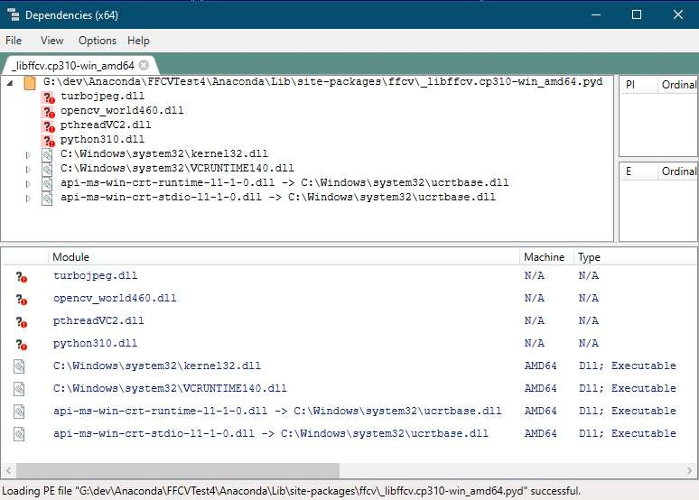
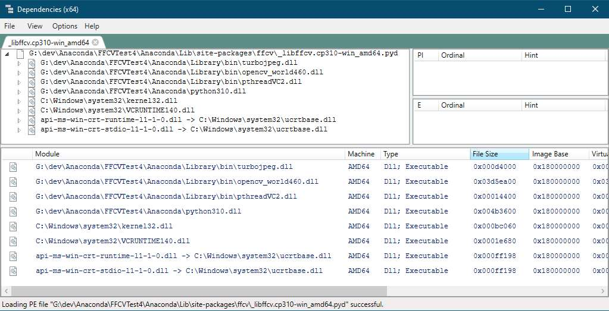
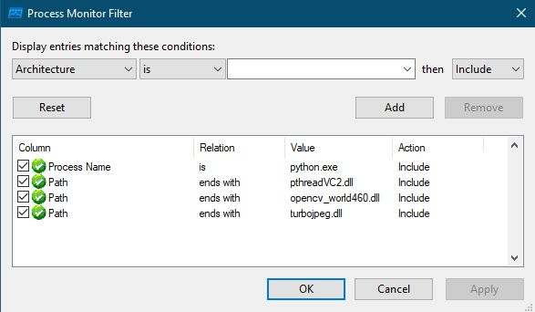
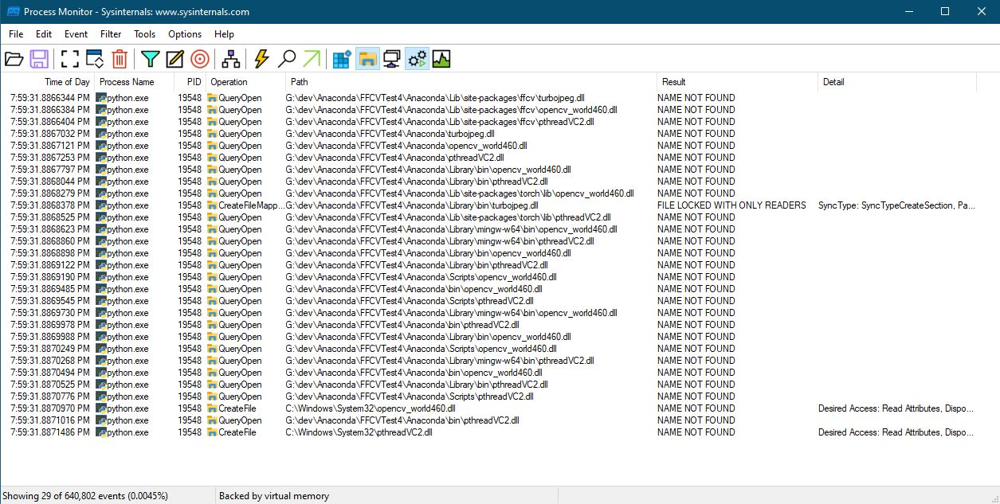

<!---
https://chatgpt.com/c/68f3a65b-232c-8329-be89-c05bc8cbf013
https://gemini.google.com/app/4ee32a52d7111ccf
https://gemini.google.com/app/f03c2f1ac2d20a92
https://gemini.google.com/app/9eca4ff0bd404da3
https://gemini.google.com/app/dd501bda3a1d042f
-->

# **Building and Installing FFCV on Windows**

_Self-contained Windows scripts for bootstrapping reproducible, isolated Python environments with natively built FFCV and Fastxtend - using Micromamba and MSVC._

## Summary

This project provides a fully automated Windows build pipeline for the and libraries. It reconstructs missing installation logic for native dependencies and configures a clean, reproducible environment using Micromamba and MS Build Tools - all without requiring a preinstalled Python setup.

The provided scripts:

- Bootstrap a self-contained, Conda-compatible environment (`Anaconda.bat`);
- Automatically fetch and prepare OpenCV, pthreads, and LibJPEG-Turbo;
- Intelligently detect and activate the MSVC toolchain (`msbuild.bat`); and
- Build and install **FFCV** and **Fastxtend** directly from PyPI in one step.

The environment targets Windows 10+ with ANSI-color-capable terminals (set `NOCOLOR=1` for graceful fallback). Its modular design emphasizes transparency, reproducibility, and debuggability, making it both a practical solution and a learning tool for developers exploring Python’s native build systems on Windows.

## 💡 Motivation

While FFCV and Fastxtend are potentially powerful tools for high-throughput data loading and fastai integration, their Windows installation workflow has long been underdocumented and partially broken. The original build process lacks proper handling of native dependencies and fails to interface cleanly with the MSVC toolchain.

This project fills that gap - providing a transparent, script-driven build system that makes native Windows installations reproducible, educational, and reliable for both experimentation and production use.

## ⚡ Quick Start

### 🧭 Prerequisites

1. **Windows 10/11:** Modern `cmd.exe` with ANSI color support is recommended.
2. **MS Build Tools:** The C++ workload is required. You can install this with the (select "Desktop development with C++").
3. **System Tools:** `curl.exe` and `tar.exe` must be in your `PATH`. (These are included by default in modern Windows 10/11).
4. **Internet Access:** Required to download libraries and packages.

> 💡 **Tip:** Set `NOCOLOR=1` (e.g., `set NOCOLOR=1`) to disable ANSI colors if your console does not support them.

### 🚀 Installation

**1. Clone the Repository:**

```
git clone https://github.com/pchemguy/FFCVonWindows.git
cd AIFFCV
```

**2. Run the Bootstrapper:**

From a clean cmd.exe prompt (i.e., without any other Python or Conda environment already activated), run the main entry point:

```
> Anaconda.bat
```

This single script will:  
- Verify all prerequisites (including MSVC, GPU, `curl`, `tar`).
- Set up a local cache directory.
- Fetch and extract OpenCV, pthreads, and LibJPEG-Turbo.
- Download Micromamba.
- Create the full Conda environment from the included YAML files.
- Install `ffcv` and `fastxtend`, compiling them with the activated MSVC toolchain.
- Verify the installation.

### ⚙️ MSVC Detection

The `Anaconda.bat` script (via `msbuild.bat`) will automatically try to find your MS Build Tools installation. It checks standard install paths, environment variables (`%ProgramFiles%`, `BUILDTOOLS`, etc.), and `PATH`. If the script fails at the **"MS Build Tools Check"** step (see screenshot below), it means it could not find MSVC installation. In such a case, set the `BUILDTOOLS` environment variable to point to your MSVC installation directory _before_ running `Anaconda.bat`. This is the directory containing the `VC`, `Common7`, etc. folders.

```
:: Example:
set "BUILDTOOLS=C:\Program Files\Microsoft Visual Studio\2022\BuildTools"
> Anaconda.bat
```


### 🎨 Color Convention

Scripts use consistent, minimal color-coded labels (set `NOCOLOR=1` for plain text):

| **Label**     | **Meaning**                                                                        |
| ------------- | ---------------------------------------------------------------------------------- |
| **`[WARN]`**  | Major stage banner, beginning of a subtask, or warning (e.g. MS Build Tools check) |
| **`[INFO]`**  | Progress and diagnostic output                                                     |
| **`[-OK-]`**  | Successful task or step completion                                                 |
| **`[ERROR]`** | Critical failure causing termination                                               |

At the end of a successful installation, you should see an `[OK]` banner as shown below.

**MS Build Tools Check - Failed**


**MS Build Tools Check - Passed**


**Successful Completion**


## 🗂️ Project Structure

This repository is designed as a self-contained build system. Here are the key components and their roles:

| **File / Directory**         | **Role**                                                                                                                                                                                                                                  |
| ---------------------------- | ----------------------------------------------------------------------------------------------------------------------------------------------------------------------------------------------------------------------------------------- |
| **`Anaconda.bat`**           | **Main Entry Point.** Orchestrates the entire bootstrap, download, and installation process. This is the only script you need to run.                                                                                                     |
| `Anaconda.yml`               | The **main Conda environment** file. Defines all Python packages (PyTorch, fastai, etc.) for the project.                                                                                                                                 |
| `Anaconda_bootstrap.yml`     | A **minimal environment** file used _only_ by `Anaconda.bat` to set up a tiny base with Micromamba and `uv` before creating the full environment.                                                                                         |
| **`conda_far.bat`**          | **Environment Activator.** This script _activates_ the fully-configured environment, ensuring MSVC and all library paths are set correctly. It is used by `Anaconda.bat` and can be run manually to enter an interactive activated shell. |
| **`msbuild.bat`**            | **MSVC Detector.** A robust helper script that finds and activates the MS Build Tools environment. Called by other scripts.                                                                                                               |
| **`libs.bat`**               | **Library Manager.** A multi-purpose script for managing native dependencies. `Anaconda.bat` calls it to download, extract, and "install" (copy) DLLs. `conda_far.bat` calls it to activate library paths.                                |
| `pthreads/activate.bat`      | Sets the `INCLUDE`, `LIB`, `LINK`, and `PATH` variables for the pthreads library.                                                                                                                                                         |
| `opencv/activate.bat`        | Sets the `INCLUDE`, `LIB`, `LINK`, and `PATH` variables for the OpenCV library.                                                                                                                                                           |
| `libjpeg-turbo/activate.bat` | Sets the `INCLUDE`, `LIB`, `LINK`, and `PATH` variables for the Conda-provided LibJPEG-Turbo library.                                                                                                                                     |

## 🔬 Deep Dive

### The General Problem: Building Native Python Packages on Windows

When `pip install` builds a package from source, it invokes the MSVC toolchain (compiler and linker). This process fails if the toolchain cannot find the C/C++ header files (`.h`), import libraries (`.lib`), and linker targets for the package's native dependencies.

Unlike Linux, which uses standard paths like `/usr/include`, Windows paths are fragmented. To find necessary files, the MSVC toolchain relies on four key environment variables:

|**Variable**|**Purpose**|
|---|---|
|`INCLUDE`|**Compiler:** Directories containing header files (`*.h`).|
|`LIB`|**Linker:** Directories containing import libraries (`*.lib`).|
|`LINK`|**Linker:** Additional arguments, including the _specific names_ of the `*.lib` files to link (e.g., `pthreadVC2.lib`).|
|`PATH`|**Runtime:** Directories containing dynamic-link libraries (`*.dll`).|

If these variables are pre-set with the correct paths _before_ `pip install` is run, the build should succeed even if the package's `setup.py` logic is broken.

### The MSVC Detection Trap: `cl.exe` is on PATH, but `pip` Fails

A common and deeply frustrating error on Windows is pip failing with:

```
Microsoft Visual C++ 14.0 or greater is required.
```

This is especially confusing when you have _already_ activated the MSVC environment (e.g., by running `vcvarsall.bat`) and can successfully run `cl.exe` from your terminal.

The problem is that `setuptools` (specifically the `setuptools\_distutils\compilers\C\msvc.py` module) ignores your `PATH`. Instead of checking for `cl.exe`, its `_get_vc_env()` function attempts to "find" MSVC using its own limited logic:

1. It calls `_find_vc2017()`, which looks for `vswhere.exe` in a **hardcoded** `%ProgramFiles(x86)%` path.
2. It calls `_find_vc2015()`, which checks a specific registry key (`HKLM\Software\Microsoft\VisualStudio\SxS\VC7`).

If you have MSVC installed in a custom location, are using a portable version, or have simply activated the environment via `vcvarsall.bat` _without_ it being in the default path/registry, these checks will fail. `setuptools` will incorrectly conclude that MSVC is not installed and raise the error, even though it is perfectly available in your shell.

**The Solution: `DISTUTILS_USE_SDK=1`**

The `setuptools` code provides an escape hatch. The _very first thing_ the `_get_vc_env()` function does is check for an environment variable:

```python
def _get_vc_env(plat_spec):
    if os.getenv("DISTUTILS_USE_SDK"):
        return {key.lower(): value for key, value in os.environ.items()}
    
    # ... rest of the detection logic ...
```

If `DISTUTILS_USE_SDK=1` is set, `setuptools` skips its entire limited detection logic and simply trusts the environment variables (`INCLUDE`, `LIB`, `LINK`, `PATH`) that are already active in the shell.

This is precisely why `conda_far.bat` (which is called by the main `Anaconda.bat` bootstrapper) sets:

```
set "DISTUTILS_USE_SDK=1"
```

This single line forces `pip` and `setuptools` to respect the environment that `msbuild.bat` has prepared, making the native compilation robust and reliable.

### The FFCV-Specific Problem

FFCV’s `setup.py` contains a function, `pkgconfig_windows()`, intended to auto-discover dependencies. However, this logic is non-functional and returns nonsensical paths. Rather than patching FFCV's source code, this project bypasses the problem by pre-populating the environment variables (`INCLUDE`, `LIB`, `LINK`) with the _correct_ values _before_ `pip` is ever called.

### The Solution: A Scripted Build Pipeline

This repository automates the entire setup:  
1. **`Anaconda.bat`** runs `msbuild.bat` to detect and activate the MSVC toolchain, setting the base `INCLUDE` and `LIB` paths.
2. It then calls `conda_far.bat` (in `/preactivate` mode) and `libs.bat` (in `/activate` mode), which in turn call the individual `*/activate.bat` scripts.
3. These scripts _prepend_ the correct paths for **pthreads**, **OpenCV**, and **LibJPEG-Turbo** to the `INCLUDE`, `LIB`, `LINK`, and `PATH` variables.
4. Finally, `Anaconda.bat` calls Micromamba to bootstrap a minimal Conda environment and then Mamba, which imports the full environment specification leading to  `pip install ffcv fastxtend` at the very end, which inherits this preconfigured environment, allowing the build to succeed without modification.
It is important to highlight that one of the dependencies, is part of the same environment file as `FFCV`. This approach works, because Conda/Mamba managers install Conda packages first before invoking `pip`/`uv`.

This project uses a mix of externally downloaded libraries and one Conda-provided library. This hybrid approach was chosen to match FFCV's requirements while minimizing conflicts.

| **Library**        | **Version**  | **Source**              | **Integration**                |
| ------------------ | ------------ | ----------------------- | ------------------------------ |
| **OpenCV**         | 4.6.0 (VC15) | Official GitHub Release | External (`libs.bat` download) |
| **pthreads-win32** | 2.9.1        | Sourceware FTP          | External (`libs.bat` download) |
| **LibJPEG-Turbo**  | (from Conda) | Conda (`Anaconda.yml`)  | Internal (Conda-provided)      |

The `activate.bat` scripts configure the environment as follows:

|               | **pthreads**       | **OpenCV**                  | **LibJPEG-Turbo**          |
| ------------- | ------------------ | --------------------------- | -------------------------- |
| **`PATH`**    | `pthreads\dll\x64` | `opencv\build\x64\vc15\bin` | `Anaconda\Library\bin`     |
| **`INCLUDE`** | `pthreads\include` | `opencv\build\include`      | `Anaconda\Library\include` |
| **`LIB`**     | `pthreads\lib\x64` | `opencv\build\x64\vc15\lib` | `Anaconda\Library\lib`     |
| **`LINK`**    | `pthreadVC2.lib`   | `opencv_world460.lib`       | `turbojpeg.lib`            |

### The Complexity of Native Dependencies on Windows

A successful build requires more than just _finding_ the compiler. You must also provide the correct versions of all native dependencies (headers, libraries, and DLLs). This is complex on Windows for several reasons:  
- **ABI Incompatibility:** C++ has an unstable Application Binary Interface (ABI). Binaries compiled with different major versions of MSVC (e.g., MSVC 2013 vs. 2015) are generally incompatible. While MSVC 2015, 2017, 2019, and 2022 share a compatible C++ ABI (major version 14), this can still be broken by certain compiler flags (like `/GL` or `/LTCG`).
- **Name Clashing:** The build toolchain (compiler/linker) and the operating system (runtime DLL loader) will use the _first_ file they find that matches a required name. This can cause failures if multiple versions of a library (e.g., a system-provided `pthreads.dll` and an environment-provided `pthreads.dll`) are on the `PATH` and the wrong one is loaded first.
- **Multiple Sources:** Dependencies can come from several places (official releases, PyPI, Conda), and they are not always compatible. 

### Four Categories of Build & Runtime Failures

When an installation fails, the error message often falls into one of four categories, each corresponding to a different stage of the process.

#### 1. `setup.py` / `pip` Errors

This is an error from the build _frontend_ (pip or setuptools) before the compiler is even invoked. It often means the `setup.py` script itself has failed. The `ffcv` `setup.py` script fails this way if it can not find OpenCV, as its custom `pkgconfig_windows` function raises an exception.

**Solution:** This error is specific to the package. For `ffcv`, this error is bypassed because the scripts ( `libs.bat`, `opencv/activate.bat`) correctly set the `PATH` environment variables _before_ `pip` runs, which satisfies the `setup.py` script's checks.

MSVC detection error discussed above is also an error of `pip`/`setuptools`.

#### 2. Compiler Errors

This is a failure from `cl.exe` (the C/C++ compiler). These errors are often due to a required header file (`.h`) not being found. The error message is typically helpful, stating specific references.

**Solution:** Ensure the directory containing the missing header file is added to the `INCLUDE` environment variable.

#### 3. Linker Errors

This is a failure from `link.exe` (the linker). This means the linker was told to find a function (an "external symbol") but could not find it in any of the `.lib` files it was given. This indicates a missing or incorrect `*.lib` file. The error message is usually a list of "unresolved external symbols," which provide clues about which dependency is missing.

**Solution:** The `tj...` symbols point to **LibJPEG-Turbo**. This error means that either the `lib` directory containing `turbojpeg.lib` was not added to the `LIB` variable, or `turbojpeg.lib` itself was not added to the `LINK` variable.

#### 4. The "DLL load failed" Runtime Error

This is the most difficult error to debug. It occurs _after_ the package has successfully compiled and installed, but fails when you try to `import` it in Python.

This error message is deeply misleading. It does not necessarily mean that `_libffcv.pyd` (the module being imported) could not be found. It can mean one of several things:

1. **The module is not found:** The file (`_libffcv.pyd`) is actually missing. (This is rare if `pip install` reported success).
2. **A direct dependency is not found:** The file `_libffcv.pyd` _was_ found, but the Windows OS loader could not find a DLL it _depends on_ (e.g., `opencv_world460.dll` or `pthreadVC2.dll`). The loader normally, but not always, checks for these DLLs in the active `PATH`.
3. **A transitive dependency is not found:** A dependency _of a dependency_ is missing. For example, `opencv_world460.dll` might itself depend on `SomeOtherLibrary.dll`, and if _that_ file is not on the `PATH`, the load will fail with the same error.
4. **An incompatible dependency was found:** A dependency _was_ found on the `PATH`, but it is incompatible (e.g., a 32-bit DLL was loaded by a 64-bit Python process, or it was compiled with an incompatible C++ runtime).

This ambiguity is what makes Windows DLL loading issues so difficult to resolve.

#### Diagnosing "DLL load failed" with `Dependencies` and `ProcMon`

To solve this, you must find out what the loader is _actually_ doing. Two essential free tools for this are  [Dependencies](https://github.com/lucasg/Dependencies) and [Sysinternals Process Monitor](https://learn.microsoft.com/en-us/sysinternals/downloads/procmon).

**Step 1: `Dependencies`**

First, open the compiled Python module (e.g., `.../Anaconda/Lib/site-packages/ffcv/_libffcv.cp311-win_amd64.pyd`) in the `Dependencies` tool.

If you launch `Dependencies.exe` from a _normal_ shell, it will (correctly) report that the module's dependencies (`python310.dll`, `opencv_world460.dll`, `pthreadVC2.dll`, etc.) are missing.



However, if you first activate this project's environment (by running `conda_far.bat`) and _then_ launch `Dependencies.exe` from that same activated shell, it will inherit the fully-configured `PATH`. Now, it will successfully find and resolve all dependencies.



This test proves that the `PATH` environment variable _is_ set correctly in the activated shell. So why does Python still fail to find them?

**Step 2: `Process Monitor` (ProcMon)**

`Dependencies` shows what _should_ happen based on the `PATH`. `ProcMon` shows what _is_ happening during execution.

1. Launch `ProcMon.exe`.
2. Set up filters (Ctrl+L) to _include_ only relevant events. The key filters are:
    - `Process Name` is `python.exe`
    - `Path` ends with `opencv_world460.dll`
    - `Path` ends with `pthreadVC2.dll`
    - `Path` ends with `turbojpeg.dll`



3. Start the capture (Ctrl+E) and then run the failing Python command in your activated shell:  

```
python -c "import ffcv, fastxtend"
```    

**The Critical Insight from `ProcMon`**

The `ProcMon` log reveals the problem. You will see a series of `NAME NOT FOUND` results as `python.exe` searches for the DLLs.



The critical observation is _where_ it looks:  
- It checks the directory containing the `.pyd` module (`.../site-packages/ffcv`).
- It checks the main Conda environment directories (`.../Anaconda/Library/bin`, etc.).
- It checks the system directory (`C:\Windows\System32`).

It completely ignores the external directories we added to the `PATH` (e.g., `.../opencv/build/x64/vc15/bin` and `.../pthreads/dll/x64`).

This is intentional. Since Python 3.8, the default DLL search order on Windows was changed to mitigate DLL hijacking vulnerabilities. It no longer uses the standard `PATH` environment variable to resolve _dependencies of extension modules_.

**The Solution**

Since Python will not look in our external staging directories, we must bring the files to Python. This is the purpose of the final step in the `Anaconda.bat` script. It copies the required runtime DLLs (`opencv_world4S60.dll` and `pthreadVC2.dll`) from their external staging directories _into_ the `Anaconda\Library\bin` directory. Because `Anaconda\Library\bin` _is_ one of the trusted, secure locations that the modern Python loader _does_ search, the `import ffcv` command now succeeds.

## 📚 References

- [FFCV GitHub Repository](https://github.com/libffcv/ffcv)
- [Fastxtend GitHub Repository](https://github.com/warner-benjamin/fastxtend)
- [Microsoft Visual C++ Build Tools](https://visualstudio.microsoft.com/visual-cpp-build-tools)
- [SO: Installing MS Build Tools for pip](https://stackoverflow.com/a/64262038/17472988)
- [Field Notes: Bootstrapping Python Environments on Windows](https://github.com/pchemguy/Field-Notes/blob/main/03-python-env-windows/README.md)
- [Field Notes: Python pip & MSVC Detection Issues](https://github.com/pchemguy/Field-Notes/blob/main/05-python-pip-msvc/README.md)
- [Dependencies](https://github.com/lucasg/Dependencies)
- [Sysinternals Process Monitor](https://learn.microsoft.com/en-us/sysinternals/downloads/procmon)
