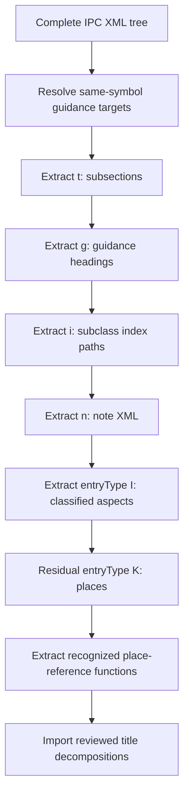

---
urls:
  - https://chatgpt.com/c/6a897e26-5a40-83eb-afa1-32a9bf36b31c
  - https://chatgpt.com/c/6a89c8a7-00b4-83eb-b9ac-f5f8385d6208
  - https://chatgpt.com/c/6a8b4197-6734-83eb-8f09-24967a39d3f8
---
# IPC Scheme XML Parsing Notes

## 1. Scope

This repository analyzes how the International Patent Classification (IPC) is organized in its XML scheme file and develops a relational representation for
structural inspection and later information modelling.

At a logical level, the file combines three different kinds of information:

- a **main classification hierarchy**, which contains the ordinary places used to classify inventions by their technical subject matter;
- a **secondary aspect hierarchy**, which supplies additional symbols for classifying recurring aspects of already classified subject matter, such as
  materials, uses, properties, or operating conditions;
- **auxiliary records**, which help present, explain, or search the two hierarchies. These records include headings that label ranges of symbols, notes that
  qualify or explain their use, subsection labels used for broad presentation, and subclass indexes that provide search-oriented topic paths leading to IPC symbols.

These logical types are not represented by different top-level XML elements. The source reuses `<ipcEntry>` for all of them and distinguishes their functions through attribute values and internal content. The immediate goal is therefore not to reproduce the XML mechanically, but to disentangle the different entities hidden behind this shared container.

The analysis is structural rather than an attempt to interpret the technical meaning of every IPC title. It asks:

- which XML elements represent nodes in either classification hierarchy;
- which elements are auxiliary search, presentation, or annotation records;
- when a symbol identifies the current node and when it only identifies the symbol or range to which an auxiliary record applies;
- how XML containment differs from IPC scope;
- which source structures should become separate relational tables.

Unless stated otherwise, claims in this document describe observations of the IPC 2027.01 early-release file, not timeless guarantees about every IPC edition.

## 2. The central modelling problem

The principal reusable container is `<ipcEntry>`. Four attributes are especially important:

| Attribute   | Role                                                                                                                                                    |
| ----------- | ------------------------------------------------------------------------------------------------------------------------------------------------------- |
| `kind`      | Identifies an auxiliary function for `i`, `g`, `n`, and `t`; for other values, identifies hierarchy level within one of the classification hierarchies. |
| `symbol`    | Either identifies the structural node itself or anchors an auxiliary record to another structural symbol, depending on `kind`.                          |
| `endSymbol` | Where present on an auxiliary record, marks the other boundary of the symbol range to which that record applies.                                        |
| `entryType` | For non-auxiliary entries, distinguishes nodes in the main classification hierarchy (`K`) from nodes in the secondary aspect hierarchy (`I`).           |

The source therefore does not have a single homogeneous `ipcEntry` entity. The meaning of an element must be resolved from `kind` and `entryType` together. For compactness, this document uses `ignt` as shorthand for the four auxiliary `kind` values:

```text
ignt = {"i", "g", "n", "t"}
```

This is only analytical shorthand; it is not an XML element or an additional source attribute. The high-level partition is:

| Condition                                | Logical function                                      |
| ---------------------------------------- | ----------------------------------------------------- |
| `kind` not in `ignt` and `entryType="K"` | Node in the main classification hierarchy             |
| `kind` not in `ignt` and `entryType="I"` | Node in the secondary aspect-classification hierarchy |
| `kind` in `ignt`                         | Auxiliary search, presentation, or annotation record  |

`kind="g"` is the important mixed case within the auxiliary records: a guidance heading may group either `K` nodes or `I` nodes. The heading does not state that choice directly; it must be resolved from a non-`ignt` entry with the same `symbol`, as described in Section 4.1.

Treating all `ipcEntry` elements as nodes in one tree would therefore conflate two distinct classification hierarchies with headings, notes, subsection labels, and search indexes.

## 3. Functional classes of `ipcEntry`

### 3.1 Special `ignt` records

| `kind` | Interpreted function | Internal structure                                  | Scope model                                                                                              |
| :----: | -------------------- | --------------------------------------------------- | -------------------------------------------------------------------------------------------------------- |
|  `i`   | Subclass index       | Hierarchical `indexEntry` tree ending in references | Anchored by the entry's `symbol`/`endSymbol`; not part of the classification hierarchy                   |
|  `g`   | Guidance heading     | Title parts, sometimes with embedded references     | Applies to a run of core places or classified aspects; routing requires same-symbol target resolution    |
|  `n`   | Semi-structured note | A `textBody` containing one or more note structures | Applies to the symbol or symbol range stated on the note entry                                           |
|  `t`   | Subsection title     | Title parts                                         | Applies to a symbol range and provides presentation-level grouping above or across classification places |

A `kind="i"` **subclass index** is a search aid. Its terms form hierarchical topic paths that end in references to classification symbols, but the terms do
not themselves constitute IPC classification places. Its internal `indexEntry` hierarchy must therefore not be confused with either of the two
classification hierarchies represented by nested `ipcEntry` elements.

In the observed file, these variants are terminal with respect to `ipcEntry`: they can contain other XML elements, but do not contain nested `ipcEntry`
elements. This should be validated when importing a new edition rather than silently assumed.

The official rendered scheme exposes the corresponding presentation structures. For example, subclass PDFs contain subclass indexes and guidance headings, while full-section contents expose subsection titles. Useful comparison material is the [IPC 2027.01 English scheme PDF directory](https://www.wipo.int/classifications/data/ipc/ITSupport_and_download_area/20270101/pdf/scheme/full_ipc/en/), including [A01B](https://www.wipo.int/classifications/data/ipc/ITSupport_and_download_area/20270101/pdf/scheme/full_ipc/en/a01b.pdf) as an example and the [full Section A scheme](https://www.wipo.int/classifications/data/ipc/ITSupport_and_download_area/20270101/pdf/scheme/full_ipc/en/ipc_en_a_full_ipc_20270101.pdf).

### 3.2 Structural records

An `ipcEntry` whose `kind` is **not** one of `i`, `g`, `n`, or `t` is treated as a structural node. Its `entryType` determines which hierarchy it belongs to:

| `entryType` | Relational interpretation                             |
| :---------: | ----------------------------------------------------- |
|     `K`     | Place in the main IPC classification hierarchy        |
|     `I`     | Node in the secondary aspect-classification hierarchy |

The name `entryType="I"` can misleadingly suggest a search index like `kind="i"`. It instead identifies real nodes in a secondary classification
hierarchy used to record common additional aspects of subject matter. It is therefore described here as the **aspect-classification hierarchy**. The
`entryType="I"` hierarchy and the `kind="i"` subclass index are structurally and logically different.

Structural records form the nested `ipcEntry` hierarchies remaining after the special records are removed. XML nesting is meaningful for these records: it determines the nearest structural parent in the corresponding hierarchy.

While IPC scheme specification also defines an auxiliary `entryType="D"`, such entries are not present in the current scheme and are intentionally outside the current model.

### 3.3 Residual coverage, relational scope exclusion, and negative technical definition

Residual places cover subject matter left over after the scope of other classification places has been accounted for. Their meaning is relational: the title may depend on explicit references, sibling places, the parent scope, or the surrounding classification structure. A residual place must consequently be interpreted against the places whose subject matter is excluded, already provided for, covered elsewhere, or otherwise distinguished.

Three related modelling tasks should nevertheless remain separate:

1. `places.residual_score` ranks candidate residual places from lexical and symbol evidence. It is a heuristic, not a semantic label.
2. `places_references` extracts reference-bearing relations expressed by `entryReference` content, including precedence and several scope-list grammars.
3. `title_decompositions` records manually reviewed negative technical definitions by splitting one source title into `base_scope` and `excluded_scope`.

The distinction matters. A title such as `CABLES OTHER THAN ELECTRIC` contains a negative technical definition but no target reference. Conversely, an extracted scope reference may limit a place without making the place a residual category. The three representations complement one another rather than describing interchangeable facts.

#### Residual candidate scoring

The XML does not carry an explicit residual-place flag. Candidate detection therefore combines lexical signals in `titlePart` with conventional symbol patterns. `residual_score` is an additive evidence score implemented as a virtual generated column; it is neither a probability nor a definitive classification.

Indicators are divided into four families. Within each family, `CASE` selects at most one contribution; contributions from different families remain additive.

| Family | Strong or primary match | Contribution | Weaker or alternative match | Contribution |
| --- | --- | ---: | --- | ---: |
| Provided-for | `not`, followed by zero to two non-space tokens, then `provided for` | `7` for a non-class-99 symbol of length at most four; otherwise `4` | `provided for` | `1` |
| Covered | `not`, followed by zero to two non-space tokens, then `covered by`, `covered in`, or `covered elsewhere` | `7` for a non-class-99 symbol of length at most four; otherwise `4` | `covered by` or `covered in` | `1` |
| Other | `other than` anywhere in the title | `1` | title begins with `Other`, provided `other than` did not match anywhere | `3` |
| Symbol | normalized main group `99/00` or `999/00`, or class `99` | `3` | — | — |

The zero-to-two-token allowance covers variants broader than the literal phrases `not provided for` and `not otherwise provided for`. The selective value `7` boosts explicit negative wording at broad levels represented by symbols of at most four characters. Class `99` is excluded from that boost because it receives its own independent three-point symbol contribution; an explicit negative expression on such a symbol contributes `4 + 3`, also totalling `7`.

Main groups `99/00` and `999/00` are represented by `0099` and `0999` at positions 5–8 of the normalized symbol. `substr(symbol, 2, 2) = '99'` detects class `99`. These patterns are useful residual heuristics, not semantic guarantees.

The positive forms remain deliberately weak. They establish a relation to subject matter assigned or covered elsewhere but do not independently establish that the current place is residual. Similarly, `other than` identifies exclusion wording that may define a negative technical category rather than a residual catchall.

The column is defined as:

```sql
residual_score INTEGER GENERATED ALWAYS AS (
    CASE
        WHEN regexpi('\bnot( \S+){0,2} provided for\b', titlePart) THEN
            CASE
                WHEN length(symbol) <= 4
                 AND substr(symbol, 2, 2) <> '99'
                    THEN 7
                ELSE 4
            END
        WHEN regexpi('\bprovided for\b', titlePart) THEN 1
        ELSE 0
    END
    +
    CASE
        WHEN regexpi('\bnot( \S+){0,2} covered (by|in|elsewhere)\b', titlePart) THEN
            CASE
                WHEN length(symbol) <= 4
                 AND substr(symbol, 2, 2) <> '99'
                    THEN 7
                ELSE 4
            END
        WHEN regexpi('\bcovered (by|in)\b', titlePart) THEN 1
        ELSE 0
    END
    +
    CASE
        WHEN regexpi('\bother than\b', titlePart) THEN 1
        WHEN regexpi('^other\b', titlePart) THEN 3
        ELSE 0
    END
    +
    CASE
        WHEN substr(symbol, 5, 4) IN ('0099', '0999')
          OR substr(symbol, 2, 2) = '99'
            THEN 3
        ELSE 0
    END
) VIRTUAL
```

Branch order is significant. The strong negative test must precede its positive subpattern, and `other than` must precede `^other`; consequently any title containing `other than`, including one beginning with those words, receives only the one-point Other-family contribution. The symbol alternatives likewise share one `CASE` and cannot stack with one another.

The total ranks candidates for review. Values `1–3` normally reflect weak, ambiguous, or symbol-only evidence; `4` is an unboosted explicit negative expression; `7` may be either a selectively boosted expression or an unboosted expression plus the class-99 symbol heuristic; and larger totals combine evidence from independent families. Because the same total can arise through different paths, downstream validation should inspect the contributing rules rather than treat a score as a self-explanatory category.

The expressions use case-insensitive `regexpi(pattern, value)` from SQLite's `ext/misc/regexp.c`. SQLite must expose that function as deterministic because generated-column expressions may call only deterministic functions. The importer checks this capability before schema mutation.

`titlePart` preserves inline XML inside its source `<text>`. The current generated expression operates on that stored serialization, not on a separately flattened text column; markup inserted inside a target phrase can therefore prevent a match. This is a known limitation of the candidate score.

#### Manually reviewed title decomposition

Automated scoring identifies candidates but does not attempt to infer an exact positive/negative split. Reviewed decompositions are maintained in the authoritative companion file `title_decompositions.sql`, whose DDL and data are imported as a unit:

```sql
CREATE TABLE title_decompositions (
    id             INTEGER PRIMARY KEY,
    symbol         TEXT NOT NULL COLLATE NOCASE CHECK (length(symbol) BETWEEN 1 AND 14),
    titlePart      TEXT NOT NULL CHECK (length(trim(titlePart)) > 0),
    base_scope     TEXT NOT NULL CHECK (length(trim(base_scope)) > 0),
    excluded_scope TEXT NOT NULL CHECK (length(trim(excluded_scope)) > 0),
    UNIQUE (symbol, titlePart)
);
```

`titlePart` retains the source title used for identification and audit. `base_scope` states the positively included subject matter; `excluded_scope` states the technical subject matter explicitly removed from that scope. The manual table is deliberately separate from `places_references`: it decomposes title semantics and need not contain an `sref` or `mref` target.

## 4. `symbol`: node identifier versus reference

The same attribute name has two different roles.

| Context                     | Meaning of `symbol`                                                                                                                     | Logical node ID? |
| --------------------------- | --------------------------------------------------------------------------------------------------------------------------------------- | :--------------: |
| Non-`ignt`, `entryType="K"` | Symbol of the core classification place represented by the element                                                                      |       Yes        |
| Non-`ignt`, `entryType="I"` | Symbol of the classified-aspect node represented by the element                                                                         |       Yes        |
| `kind="g"`                  | Start/anchor symbol identifying the structural entry whose type also determines whether the heading belongs to the core or index scheme |        No        |
| `kind="i"`                  | Anchor or start of the range for which the subclass index is supplied                                                                   |        No        |
| `kind="n"`                  | Anchor or start of the range to which the note applies                                                                                  |        No        |
| `kind="t"`                  | Anchor or start of the range covered by the subsection title                                                                            |        No        |

For a structural record, `symbol` identifies the node encoded by that element. For an `ignt` record, it describes attachment or scope. It should not be treated as a primary key for the auxiliary record and it does not make that record a second copy of the same structural node.

`endSymbol`, where present, completes the scope range. The pair
`(symbol, endSymbol)` describes applicability; it is not necessarily a unique
record identifier. Multiple auxiliary records may legitimately be anchored to
the same structural symbol or range.

This distinction also explains why a special record's immediate XML parent is not stored merely to infer its IPC scope. For these records, scope is stated by `symbol` and `endSymbol`; XML placement is primarily a source-organization fact.

### 4.1 Guidance-heading resolution

`kind="g"` needs an additional resolution step because the source does not state whether the heading groups core places or classified aspects.

For each guidance entry:

1. take the guidance entry's `symbol`;
2. find an `ipcEntry` with the same `symbol`;
3. exclude all candidates whose `kind` is in `ignt`;
4. read the remaining structural target's `entryType`;
5. route `K` to `gheadings_core` and `I` to `gheadings_index`.

The target type is a routing discriminator only and is not stored. Resolution is by same-symbol structural lookup, **not** by the guidance entry's XML parent. Missing targets or conflicting eligible target types should be treated as audit failures rather than guessed.

### 4.2 References inside content

The source also contains explicit reference elements:

- `<sref ref="...">` identifies one symbol;
- `<mref ref="..." endRef="...">` identifies a symbol range.

These are references by definition and are distinct from the overloaded `ipcEntry/@symbol` issue. Their relational representation depends on context:

- references in core guidance headings remain embedded as XML markup;
- references in index guidance headings are parsed into compact JSON target lists, with any recognized exclusion list stored on the same `gheadings_index` row;
- subclass-index references are normalized into compact JSON arrays;
- reference markup inside notes remains preserved;
- references attached to place title parts are initially preserved as XML-bearing strings in `places.refs`, then recognized reference functions are extracted into `places_references`; unmatched strings remain in `places.refs` unchanged.

## 5. XML-model-aware parsing strategy

Parsing is a staged decomposition of one mutable XML tree. Each stage extracts one understood record class and removes the corresponding `ipcEntry` subtrees. Later stages therefore operate on a progressively simpler residual model.



Guidance target resolution must occur while the complete tree is still available. Extraction then proceeds in this order:

1. `kind="t"` — subsection titles;
2. `kind="g"` — guidance headings, routed using the precomputed target types;
3. `kind="i"` — subclass index paths;
4. `kind="n"` — notes retained as XML;
5. remaining `entryType="I"` — classified-aspect hierarchy;
6. remaining `entryType="K"` — core classification-place hierarchy;
7. database-backed post-processing of `places.refs` into `places_references`, in the fixed order `precedence` → `scope_list` → `scope_example` → `scope`;
8. execution of the authoritative `title_decompositions.sql` DDL and data inside the same import transaction.

This order is not merely an implementation convenience. It corresponds to the source model:

- the four special kinds are extracted according to their own internal grammar;
- removing them prevents presentation and annotation records from contaminating structural parentage;
- classified aspects are then separated from core classification places;
- after the earlier removals, the residual tree has a much narrower and more auditable interpretation.
- place creation remains a source-faithful operation; only after all place rows exist does a separate stage parse recognized `entryReference` grammars and remove the successfully processed array items from `places.refs`.

### 5.1 Ownership boundaries

When collecting content owned by one `ipcEntry`, nested `ipcEntry` elements are boundaries. A parent's title, note, or index content must not accidentally absorb the content of a structural descendant.

Likewise, internal hierarchies must be followed according to their own element type:

- `indexEntry` nesting defines subclass-index paths;
- remaining `entryType="I"` nesting defines classified-aspect parents;
- remaining `entryType="K"` nesting defines classification-place parents.

### 5.2 Validation before interpretation

The parser should fail visibly when an observed structural invariant changes. At minimum, each edition should be checked for:

- nested `ipcEntry` elements inside any `ignt` record;
- unresolved or ambiguously resolved guidance symbols;
- unrecognized `gheadings_index` boilerplate beginning with `Indexing scheme`;
- malformed guidance target or exclusion reference lists;
- `kind="i"` subtrees without `indexEntry` descendants;
- terminal index entries without references;
- missing required `ref` or `endRef` attributes;
- malformed or multiply owned note bodies;
- residual `ipcEntry` records that are neither modelled `I` nor `K` entries;
- duplicate structural symbols within a relational hierarchy;
- parent symbols that do not resolve within the same hierarchy;
- malformed JSON in `places.refs` or non-string array elements;
- reference fragments that superficially match a supported function but contain malformed `sref`/`mref` XML or invalid range attributes;
- preservation-mode states in which only one of the coupled `places` and `places_references` tables exists;
- absence or incompatibility of deterministic `regexpi(pattern, value)` support before creating `places`;
- an imported `title_decompositions` table that does not expose the expected five-column contract.

## 6. Relational model

The relational model deliberately uses separate tables for source structures with different identity, hierarchy, and content semantics.

| Table | Columns | One row represents |
| --- | --- | --- |
| `subsections` | `title_parts, symbol, endSymbol` | One `kind="t"` auxiliary record |
| `gheadings_core` | `title_parts, symbol, endSymbol` | One `kind="g"` heading applying to core places |
| `gheadings_index` | `title_parts, symbol, endSymbol, refs, exclusion_list` | One nonempty normalized `kind="g"` heading applying to classified aspects |
| `index_terms` | `symbol, endSymbol, terms, refs` | One root-to-terminal path through a `kind="i"` index tree |
| `notes` | `symbol, endSymbol, note_xml` | One `kind="n"` auxiliary record |
| `classified_aspects` | `kind, symbol, parent_symbol, terms` | One structural non-`ignt`, `entryType="I"` node |
| `places` | `kind, symbol, parent_symbol, titlePart, refs, residual_score` | One owned title part of a structural non-`ignt`, `entryType="K"` place |
| `places_references` | `id, symbol, titlePart, higher_priority_refs, exclusion_scope, function` | One extracted reference relation, or one expanded clause of a scope-list source |
| `title_decompositions` | `id, symbol, titlePart, base_scope, excluded_scope` | One manually reviewed positive/negative decomposition of a place title |

JSON values are stored in SQLite `TEXT` columns and constrained to the expected JSON container type. A one-item collection remains an array. Absence of an optional structured value is SQL `NULL`, not serialized JSON `null`.

### 6.1 `subsections`

```sql
subsections(title_parts, symbol, endSymbol)
```

- `title_parts`: JSON array containing the textual content of each owned `titlePart` in source order;
- `symbol`, `endSymbol`: copied scope boundaries.

Subsections are presentation-level range labels, not hierarchy nodes. Their symbols are therefore not converted into parent links or primary keys.

### 6.2 Guidance headings

```sql
gheadings_core(title_parts, symbol, endSymbol)
gheadings_index(title_parts, symbol, endSymbol, refs, exclusion_list)
```

The same-symbol resolution described in Section 4.1 routes each source heading before its content is transformed. The two target domains then follow deliberately different workflows.

#### Core guidance

`gheadings_core.title_parts` is a JSON array containing the owned title-part content in source order. Inline `<sref>` and `<mref>` elements remain embedded as XML; their attributes are neither parsed nor validated as reference values. The outer `<text>` wrapper is omitted. There is no `refs` column.

This preservation rule avoids imposing the narrowly formulaic index-guidance grammar on ordinary core headings.

#### Index guidance

`gheadings_index` is partially normalized. Source references are first parsed into temporary ordered lists and associated with their grammatical role. Stored `refs` contains the heading's target list, while `exclusion_list` contains any recognized exception targets. Both use the same compact representation as `index_terms`:

- `sref` becomes its `ref` string;
- `mref` becomes `[ref, endRef]`;
- the containing list remains a JSON array even when it has one item.

For example:

```json
["B62D0006000000", ["B23K0001000000", "B23K0031000000"]]
```

Each stored value is one list directly; neither column uses `{sref: ...}` or `{mref: ...}` objects. A missing target or exclusion list is stored as SQL `NULL` in the corresponding column.

Recognized indexing boilerplate is removed from `title_parts`. The result contains plain subject strings:

```text
Indexing scheme associated with group <sref .../>, relating to the type of sport.
→ Type of sport

Indexing scheme relating to circuit arrangements for AC distribution networks.
→ Circuit arrangements for AC distribution networks
```

Normalization is conservative and deterministic:

- optional commas, singular/plural `group` and `subclass` wording, and the observed optional conjunctions are accepted only in defined positions;
- conjunctions and punctuation joining adjacent source references are consumed as reference-list grammar; they do not survive as synthetic title text, and no internal reference placeholder is stored in `title_parts`;
- a leading case-insensitive `The` is removed from an extracted subject;
- only the first cased character is uppercased, preserving acronyms such as `CAD`, `AC`, and `CHP`;
- one final period is removed;
- non-boilerplate headings remain unchanged;
- text beginning with `Indexing scheme` but matching no recognized rule is an error.

A pure association contains no subject after filtering. It therefore produces an empty `title_parts` array temporarily, and the entire `gheadings_index` row is then dropped. Reference parsing and validation occur before this filtering step, so malformed source references are not hidden by the dropped row.

#### Exclusions

The supported exclusion form is parsed as three independent components: the main target list, an exclusion list, and the remaining subject. In outline, it consists of a main association followed by a comma, case-insensitive `with the exception of`, one or more punctuation-free words, an exclusion reference list, and the `relating to` subject clause. The matcher tolerates the defined singular/plural and optional comma/conjunction variants but remains anchored to the complete heading.

For example, this source:

```xml
<text>Indexing scheme associated with group <sref ref="B62D0006000000" />, with the exception of groups <mref endRef="B62D0006100000" ref="B62D0006020000" />, relating to driving conditions sensed and responded to.</text>
```

produces the guidance row:

```json
title_parts = ["Driving conditions sensed and responded to"]
refs = ["B62D0006000000"]
exclusion_list = [["B62D0006020000", "B62D0006100000"]]
```

The target and exclusion lists now remain on the same guidance row; no synthetic identity or separate relationship table is needed. `exclusion_list` is SQL `NULL` when the recognized heading has no exception clause.

The compact target list in `gheadings_index.refs` can be expanded into a uniform relational form when individual target references need to be joined or filtered. The following query is the intended basis for a view that may be added to the parser later:

```sql
SELECT
    title_parts,
    symbol,
    endSymbol,
    CASE substr(r.value, 1, 1)
        WHEN '[' THEN
            r.value ->> '[0]'
        ELSE
            r.value
    END AS ref,
    CASE substr(r.value, 1, 1)
        WHEN '[' THEN
            r.value ->> '[1]'
        ELSE
            NULL
    END AS endRef
FROM gheadings_index, json_each(refs) AS r;
```

`json_each(refs)` emits one row per target reference. A scalar `sref` value becomes `ref` with `endRef` set to SQL `NULL`; a two-item `mref` array becomes its `ref` and `endRef` bounds. The original guidance row is repeated once for each target reference while its `title_parts`, `symbol`, `endSymbol`, and `exclusion_list` remain available for context. Rows whose `refs` value is SQL `NULL` produce no rows in this expansion. `exclusion_list` can be expanded independently with another `json_each` when individual exception targets are required. A future view can also expose `r.key` as a zero-based target-reference index if source order must be addressable explicitly. This query is documented for later use only; the current parser does not create the view.

### 6.3 `index_terms`

```sql
index_terms(symbol, endSymbol, terms, refs)
```

One `kind="i"` subtree can contain a branching hierarchy of `indexEntry` elements. Each root-to-terminal path becomes one row.

- `terms`: JSON array of owned `<text>` values encountered from the path root to the terminal `indexEntry`, in logical top-to-bottom order;
- `refs`: nonempty JSON array parsed from the terminal entry's `<references>`;
- `sref`: stored as a symbol string;
- `mref`: stored as `[ref, endRef]`;
- comma and semicolon separator text: ignored because no stable distinction has been established.

The outer JSON array is retained even when a path or reference list contains one item.

The compact `refs` representation can be expanded into a uniform relational form when individual references need to be joined or filtered. The following query is the intended basis for a view that may be added to the parser later:

```sql
SELECT
    symbol,
    endSymbol,
    terms,
    CASE substr(r.value, 1, 1)
        WHEN '[' THEN
            r.value ->> '[0]'
        ELSE
            r.value
    END AS ref,
    CASE substr(r.value, 1, 1)
        WHEN '[' THEN
            r.value ->> '[1]'
        ELSE
            NULL
    END AS endRef
FROM index_terms, json_each(refs) AS r;
```

`json_each(refs)` emits one row per source reference. A scalar `sref` value becomes `ref` with `endRef` set to SQL `NULL`; a two-item `mref` array becomes its `ref` and `endRef` bounds. These names deliberately retain the source attributes used by `<sref>` and `<mref>`. The original `index_terms` row is therefore repeated once for each reference while its `symbol`, `endSymbol`, and `terms` values remain available for context. A future view can also expose `r.key` as a zero-based reference index if source order must be addressable explicitly. This query is documented for later use only; the current parser does not create the view.

### 6.4 `notes`

```sql
notes(symbol, endSymbol, note_xml)
```

Notes are not semantically flattened at this stage. The owned `<textBody>` root is renamed to `<xml>`, while its entire inner structure—including `<note>`, `<subnote>`, `<noteParagraph>`, `<sref>`, and `<mref>` — is preserved and beautified. The stored text begins with an XML declaration:

```xml
<?xml version="1.0" encoding="UTF-8"?>
<xml xmlns="http://www.wipo.int/classifications/ipc/masterfiles">
  <note>
    ...
  </note>
</xml>
```

The synthetic `<xml>` root makes each database value a well-formed XML document. The declaration also allows tools such as DB Browser for SQLite to recognize the cell as XML automatically. Preserving XML is preferable to premature relational normalization because the observed note grammar is varied and only partially understood.

### 6.5 `classified_aspects`

```sql
classified_aspects(kind, symbol, parent_symbol, terms)
```

- `symbol`: logical identifier of the structural `I` node;
- `parent_symbol`: nearest enclosing `entryType="I"` node's symbol;
- `terms`: JSON array of the current node's meaningful title parts only.

Ancestor titles are not repeated in `terms`; hierarchy is represented once by `parent_symbol`. One or several title parts therefore become `["Term"]` or
`["Term A", "Term B"]` respectively.

Titles matching formulaic `Indexing scheme associated with <word>` wording are treated as unnamed grouping labels. A top-level grouping node stores SQL `NULL` in `terms`; a nested grouping node stores `[]`. The row itself remains because it still participates in the structural hierarchy.

### 6.6 `places`

```sql
places(kind, symbol, parent_symbol, titlePart, refs, residual_score)
```

`places` is normalized with respect to owned title parts and their attached `entryReference` elements. One structural place can therefore produce several rows:

- `kind`: hierarchy level;
- `symbol`: logical identifier of the core classification place;
- `parent_symbol`: nearest enclosing structural `entryType="K"` place's symbol;
- `titlePart`: scalar content of one owned `<titlePart>`, with inline XML inside its `<text>` preserved;
- `refs`: JSON array containing that same title part's owned `<entryReference>` strings in source order, or SQL `NULL` when none remain;
- `residual_score`: virtual generated candidate score defined in Section 3.3 and recomputed from `symbol` and `titlePart` when read.

Hierarchy fields repeat across the rows belonging to the same place. This repetition is deliberate: the row is the association between one place and one title part, not a manufactured title-part entity with a synthetic key.

At creation time, `refs` is either SQL `NULL` or a flat JSON array such as:

```json
[
  "combined with apparatus performing additional operations while mowing <mref endRef=\"A01D0041000000\" ref=\"A01D0037000000\" />, <sref ref=\"A01D0043000000\" />",
  "convertible to apparatus for purposes other than mowing <sref ref=\"A01D0042000000\" />"
]
```

The subsequent reference-extraction stage examines each array item independently. A successfully parsed item is moved to `places_references`; unmatched items retain their relative order and byte-level content in `places.refs`. When every item has been consumed, `refs` becomes SQL `NULL`, never an empty JSON array.

### 6.7 `places_references`

```sql
places_references(
    id,
    symbol,
    titlePart,
    higher_priority_refs,
    exclusion_scope,
    function
)
```

This table contains the recognized semi-structured relations extracted from `places.refs` after `places` has been populated.

- `id`: generated row identifier;
- `symbol`, `titlePart`: copied from the source `places` row;
- `higher_priority_refs`: nonempty JSON array of normalized targets, using a string for `sref` and `[ref, endRef]` for `mref`;
- `exclusion_scope`: normalized textual clause qualifying the relation, or SQL `NULL` when absent;
- `function`: extraction grammar and relation role: `precedence`, `scope_list`, `scope_example`, or `scope`.

The column name `higher_priority_refs` originates with the first implemented `precedence` workflow. For the three scope functions it contains target references, not higher-priority places; consumers must therefore interpret it together with `function`.

| `function` value | Source form | Rows emitted | Treatment of source text |
| ---------------- | ----------- | ------------ | ------------------------ |
| `precedence` | Reference list followed by `take(s) precedence` | One | Retain qualifying prefix/suffix as `exclusion_scope` |
| `scope_list` | Several textual clauses, each ending in references, with the complete item ending in a reference | One per clause | Reconstruct common/shared text for each expanded clause |
| `scope_example` | Independently valid base scope followed by `, e.g. ...` | One | Retain the base and discard the complete example suffix |
| `scope` | Optional reference-free prefix followed by one terminal reference list | One | Retain the complete flattened prefix |

#### `precedence`

The precedence pass recognizes one contiguous `sref`/`mref` list followed by case-insensitive `take precedence` or `takes precedence`. It supports comma separators, `and`, `or`, Oxford-comma forms, and variable XML/ordinary whitespace. References are parsed as XML, so recognition does not depend on SQLite's optional `REGEXP` extension, source attribute order, or a fixed amount of whitespace.

Text before or after the reference-list-plus-verb core becomes `exclusion_scope`. For a prefix containing a comma, text after its last comma is treated as a collective descriptor for the target list and discarded; the text preceding that comma is retained. A comma-free prefix is retained in full. A suffix following `take(s) precedence` is retained. If both sides occur, they are joined in source order with `; `. Absence is stored as SQL `NULL`.

For example:

```text
if applicable to other machine tools, <mref endRef="B23Q0017000000" ref="B23Q0015000000" /> take precedence
```

becomes conceptually:

```json
higher_priority_refs = [["B23Q0015000000", "B23Q0017000000"]]
exclusion_scope = "if applicable to other machine tools"
function = "precedence"
```

#### `scope_list`

This pass expands a terminal multi-clause reference list into one row per clause. The complete source item must end in an `sref`/`mref` list. Each emitted row receives the reconstructed clause text in `exclusion_scope`, the clause's ordered reference list in `higher_priority_refs`, and `function = "scope_list"`.

The parser distinguishes common text that applies to every clause, shared clause prefixes, distinctive clause text, and the reference group terminating that clause. Operationally, it identifies each terminal reference group, derives shared wording from the longest leading token sequence of later clauses that also occurs in the first clause, and prepends the first clause's preceding common text to later clauses. Same-clause multi-reference groups remain one JSON list rather than becoming separate semantic clauses. General non-reference inline markup is flattened to its logical text. Comma and `and`/`or` clause separators are supported. Items with text after the final reference are ineligible.

For example:

```text
of electrodes <sref ref="H01M0004000000" />, of non-active parts <sref ref="H01M0050000000" />
```

produces two `scope_list` rows whose `(exclusion_scope, higher_priority_refs)` values are conceptually:

```json
["of electrodes", ["H01M0004000000"]]
["of non-active parts", ["H01M0050000000"]]
```

This pass runs before the example and ordinary scope passes so a genuine multi-clause list containing `e.g.` remains a `scope_list` rather than losing its example clause.

#### `scope_example`

This pass handles a base scope relation followed by a disposable example suffix:

```text
electrotherapy <sref ref="A61N" />, e.g. applying alternating or intermittent electric currents for producing anaesthesia <sref ref="A61N0001340000" />
```

The retained portion must itself consist of a reference-free textual prefix followed by one terminal `sref`/`mref` list. The base list may contain several references, and general non-reference inline markup is flattened. The complete case-insensitive `, e.g. ...` suffix—including all example text and references—is discarded. The result stores `"electrotherapy"` as `exclusion_scope`, `["A61N"]` as `higher_priority_refs`, and `function = "scope_example"`.

Because `scope_list` runs first, `e.g.` text that participates in a true list expansion is not processed by this pass.

#### `scope`

The final pass recognizes an optional textual prefix followed by exactly one terminal contiguous `sref`/`mref` list. No earlier direct or nested `sref`/`mref` may occur in the prefix, and no text or markup may follow the terminal list. Non-reference inline markup is allowed in the prefix and flattened to logical text; for example, `<u>see</u>` becomes `see`.

The complete normalized prefix is stored without the precedence pass's collective-term filtering. A reference-only item therefore has `exclusion_scope = NULL`. Rows use `function = "scope"`.

The compact target array can be expanded consistently across all four functions:

```sql
SELECT
    pr.id,
    pr.symbol,
    pr.titlePart,
    pr.exclusion_scope,
    pr.function,
    r.key AS ref_index,
    CASE r.type
        WHEN 'array' THEN r.value ->> '$[0]'
        ELSE CAST(r.value AS TEXT)
    END AS ref,
    CASE r.type
        WHEN 'array' THEN r.value ->> '$[1]'
        ELSE NULL
    END AS endRef
FROM places_references AS pr,
     json_each(pr.higher_priority_refs) AS r;
```

`ref_index` preserves source order within each stored target list. For scope rows, `ref`/`endRef` are targets; only `function = 'precedence'` asserts the higher-priority relationship implied by the physical column name.

### 6.8 `title_decompositions`

```sql
title_decompositions(id, symbol, titlePart, base_scope, excluded_scope)
```

This manually curated table stores reviewed title-level exclusions that cannot be recovered merely by parsing `sref` or `mref` elements. Its DDL and rows come from `title_decompositions.sql`; the importer does not reconstruct the schema or data in Python.

- `id`: supplied primary key;
- `symbol`, `titlePart`: identify the source place row under a case-insensitive symbol comparison and the exact reviewed title;
- `base_scope`: positively included technical scope;
- `excluded_scope`: technical scope excluded by the title's negative definition.

All four text values are required to be nonempty after trimming, `symbol` is constrained to 1–14 characters, and `(symbol, titlePart)` is unique. Because the SQL file is authoritative, changes to this manual corpus should be made there and imported on the next default rebuild.

## 7. Post-processing principles

Post-processing is intentionally asymmetric because different source structures have been understood to different degrees.

1. **Normalize only where the source grammar is narrow and deterministic.** Index-guidance target and exclusion lists, together with index-terminal references, have sufficiently explicit structure to be represented as compact JSON safely.
2. **Create places before interpreting their references.** XML-to-`places` extraction remains independent of the later reference grammars. Reference parsing is a database-backed derivation over already-created `places` rows.
3. **Move only successfully recognized items.** Each `places.refs` array item is processed independently. Recognized items move to `places_references`; every unmatched item stays in `places.refs` unchanged and in source order.
4. **Use ordered, non-overlapping passes.** `precedence`, `scope_list`, `scope_example`, and `scope` run in that order. Each later pass sees only the residual items left by earlier, more specific grammars.
5. **Parse reference markup structurally.** The post-processing stage uses wrapped XML rather than SQLite `REGEXP`, so XML whitespace and attribute order do not control correctness.
6. **Preserve source markup where semantics remain uncertain.** Core-guidance references, notes, inline place-title markup, and unmatched place reference strings remain XML-bearing content rather than being split speculatively.
7. **Separate hierarchy from labels.** Parent links store structural ancestry; title values store only node-local labels rather than denormalized paths.
8. **Retain positional information.** Repeated place rows preserve title-part ownership, JSON arrays preserve reference order, and `ref_index` can expose that order relationally.
9. **Use SQL `NULL` for absence.** JSON arrays represent present collections; SQL `NULL` means an optional value is absent. A consumed `places.refs` array becomes SQL `NULL`, not `[]`.
10. **Reject or retain rather than guess.** Unrecognized index-guidance boilerplate is an error because it belongs to a closed normalization workflow. Unrecognized place-reference prose remains residual source content because that workflow is intentionally incremental.
11. **Keep reviewed semantics explicit.** Candidate scoring and reference parsing do not silently populate `title_decompositions`; its positive/negative splits remain human-reviewed source data.

### 7.1 Database ownership, reruns, and preservation

The importer owns the nine tables documented in Section 6. In its normal rebuild mode it drops and recreates owned tables inside one transaction, including obsolete owned schemas from prior revisions where applicable. `title_decompositions` is recreated by executing the DDL and data in `title_decompositions.sql`; the other current tables are created by the importer. Unrelated database objects are not part of that ownership boundary.

The XML stages populate the source-derived tables first. The database-backed place-reference stage then inserts derived rows into `places_references` and updates only the corresponding `places.refs` values. These operations occur in the same transaction, so a failure does not leave a partially extracted reference set.

Preservation mode treats `places` and `places_references` as a coupled pair. Both must already exist or both must be absent. Preserving only one side is rejected because it would either mutate a table declared preserved or retain derived rows that no longer correspond to the current residual `places.refs` values.

In preservation mode, an existing `title_decompositions` table is left untouched and the companion SQL file is not required for that table. In default mode the file must be available, and its statements execute under the importer's transaction. Outer `BEGIN`/`COMMIT` dump wrappers are ignored so the importer retains transaction control; rollback or savepoint controls inside the companion script are rejected.

## 8. Why the model is split into multiple tables

A single `ipc_entries` table would obscure several incompatible notions:

- node identity versus range attachment;
- classification hierarchy versus internal index hierarchy;
- core classification versus classified-aspect domains;
- normalized references versus preserved XML fragments;
- index-guidance targets versus exclusions stored alongside those targets;
- node-local titles versus path-expanded index terms;
- source-faithful place reference strings versus extracted relation functions;
- one place's structural identity versus its several title-part rows;
- precedence targets versus scope targets that share a historical column name but differ by `function`;
- machine-ranked residual candidates versus manually reviewed title decompositions.

The multi-table model makes these distinctions explicit. It also avoids manufacturing universal synthetic identifiers for auxiliary records whose
source symbols are scope anchors rather than record IDs.

The split is therefore semantic normalization, not merely a convenience for the current workflow.

## 9. Known limitations and open work

- The observations need to be repeated against later IPC editions to distinguish stable invariants from 2027.01-specific regularities.
- `entryType="D"` is deliberately not modelled here.
- Source `edition` values and global source-order fields are not retained in the current relational model.
- Notes remain semi-structured XML and require a separate structural survey before further normalization.
- Index-guidance exclusion parsing currently recognizes the observed anchored boilerplate form; new formulations beginning with `Indexing scheme` intentionally fail until reviewed and added explicitly.
- `places_references.higher_priority_refs` is semantically exact for `function = 'precedence'` but is a legacy name for ordinary targets in the three scope functions. A future schema revision may rename it to a function-neutral term.
- Place-reference extraction covers only the four documented grammars. Remaining `places.refs` values are deliberate residual data for later modelling, not necessarily parser failures.
- The `scope_list` reconstruction rule is structural and deterministic but remains an interpretation of elliptical natural-language coordination; new clause patterns should be audited before broadening it.
- `scope_example` intentionally discards the complete example suffix after retaining the independently valid base scope relation. It does not store example references elsewhere.
- `residual_score` is heuristic, and inline XML can interrupt lexical patterns because matching operates on the stored `titlePart` serialization.
- `title_decompositions` is a selective manual corpus, not an exhaustive catalogue of every negative technical definition in the scheme.
- Reference markup inside note XML and unprocessed place-reference strings is not yet exposed as relational edges.
- The meaning of absent `endSymbol` should be documented from authoritative IPC specifications or validated systematically before an inferred range rule is encoded.
- Candidate keys, uniqueness constraints, and foreign-key constraints should be enabled only after full-scheme audits confirm the relevant invariants.
- The relational model captures the imported edition, not cross-edition symbol continuity, renaming, creation, deletion, or transfer history.

## 10. Running and inspecting the importer

The relational importer accepts an IPC scheme XML filename as its positional input. When the filename is omitted, it searches the current directory for a file matching `EN_ipc_scheme_YYYYMMDD.xml`. The output database uses the input stem with a `.db` extension and is created beside the source file. A default rebuild also expects the authoritative `title_decompositions.sql` DDL/data file in the current directory.

```shell
python scripts/ipc_scheme_to_sqlite.py EN_ipc_scheme_20270101.xml
```

Use the script's `--help` output for the current preservation option and other CLI details. In default mode, rerunning the importer rebuilds its owned tables but leaves unrelated database objects alone. The work is transactional: a parsing, validation, or insertion failure rolls back the import rather than committing a mixture of old and new owned data.

SQLite JSON1 support is required for the JSON constraints, reference-array updates, and inspection queries documented here. The importer also requires deterministic `regexpi(pattern, value)` support from `ext/misc/regexp.c` because `places.residual_score` is a generated column. It checks that capability before parsing the XML or mutating the schema.

Useful first checks after import include:

```sql
-- Counts by extracted place-reference function.
SELECT function, count(*) AS rows
FROM places_references
GROUP BY function
ORDER BY function;

-- Residual entryReference strings not handled by the current four grammars.
SELECT
    p.symbol,
    p.titlePart,
    r.key AS ref_index,
    CAST(r.value AS TEXT) AS residual_ref
FROM places AS p,
     json_each(p.refs) AS r
ORDER BY p.symbol, p.titlePart, r.key;

-- Place symbols represented by more than one owned title part.
SELECT symbol, count(*) AS title_parts
FROM places
GROUP BY symbol
HAVING count(*) > 1
ORDER BY symbol;

-- Highest-ranked residual candidates and any reviewed decomposition.
SELECT
    p.symbol,
    p.titlePart,
    p.residual_score,
    d.base_scope,
    d.excluded_scope
FROM places AS p
LEFT JOIN title_decompositions AS d
  ON d.symbol = p.symbol
 AND d.titlePart = p.titlePart
WHERE p.residual_score > 0
ORDER BY p.residual_score DESC, p.symbol, p.titlePart;
```

The second query is especially important during continued modelling: its result is the remaining semi-structured workload after all recognized items have been moved to `places_references`.

## 11. Included scripts

The [`scripts/`](scripts/) directory contains the current relational importer and supporting utilities used to inspect or isolate parts of the XML model. `ipc_scheme_to_sqlite.py` implements the relational model documented above; the other scripts are focused audit tools, extractors, format converters, or earlier modelling experiments.

| Script | Function and use |
| --- | --- |
| [`replace.py`](scripts/replace.py) | Hard-coded byte-replacement experiment that writes an `_notext` copy of one scheme file; edit its path and byte patterns before use. |
| [`extract_entryType_I.py`](scripts/extract_entryType_I.py) | Extracts the outermost complete `entryType="I"` subtrees to a standalone XML document while retaining nested matching entries. |
| [`extract_ipc_entries.py`](scripts/extract_ipc_entries.py) | Successively extracts `kind="t"`, `kind="g"`, `kind="i"`, `entryType="I"`, and `kind="n"` subtrees into separate XML files for structural inspection. |
| [`extract_kind_n_under_entrytype_i.py`](scripts/extract_kind_n_under_entrytype_i.py) | Extracts every `kind="n"` subtree occurring below an `entryType="I"` entry. |
| [`ipc_entries_to_sqlite.py`](scripts/ipc_entries_to_sqlite.py) | Creates a flat SQLite inventory of every `ipcEntry` and its `kind`, `entryType`, `symbol`, and `endSymbol` attributes. |
| [`ipc_entries_to_sqlite_grouped.py`](scripts/ipc_entries_to_sqlite_grouped.py) | Earlier relational prototype that separates `K`, `I`, and `ignt` entries and records selected immediate relationships. |
| [`ipc_entry_stats.py`](scripts/ipc_entry_stats.py) | Reports `ipcEntry` counts by `kind`, by `entryType`, and by their combinations, as tables or JSON. |
| [`ipc_scheme_core.py`](scripts/ipc_scheme_core.py) | Produces a beautified `_core.xml` copy after removing all `ignt` and `entryType="I"` subtrees. |
| [`ipc_scheme_to_sqlite.py`](scripts/ipc_scheme_to_sqlite.py) | Implements the staged XML-aware conversion, ordered extraction of recognized place-reference functions, generated residual scoring, and transactional import of `title_decompositions.sql` into the SQLite model documented in Section 6. |
| [`ipc_xml_to_treeline.py`](scripts/ipc_xml_to_treeline.py) | Projects every `ipcEntry` and its XML attributes into a TreeLine hierarchy for interactive exploration. |
| [`list_xml_tags.py`](scripts/list_xml_tags.py) | Inventories XML tag counts, attribute names, and immediate parent-child tag pairs in SQLite. |

## 12. Summary

The essential interpretation is:

```text
non-ignt ipcEntry  → structural node; symbol attribute identifies that node
ignt ipcEntry      → auxiliary record; symbol/endSymbol attributes describe attachment or scope
```

Parsing should therefore begin by resolving and removing the special record classes according to their own grammars. Only then should the remaining `I` and `K` entries be read as two structural hierarchies and projected into `classified_aspects` and `places`.

After `places` is created, recognized `entryReference` functions are extracted incrementally from `places.refs` into `places_references` in specificity order. Successfully interpreted items leave the residual array; unknown forms remain available for later analysis. The generated `residual_score` ranks lexical and symbol-based candidates, while `title_decompositions.sql` supplies a separate reviewed corpus of exact `base_scope`/`excluded_scope` splits.

This separation between source decomposition, structural hierarchy construction, incremental reference extraction, heuristic candidate ranking, and reviewed semantic decomposition is the foundation of the relational model.

## Notes

- Consider performing word frequency analysis on `places.titlePart` (e.g., single word, pairs, triplets).
